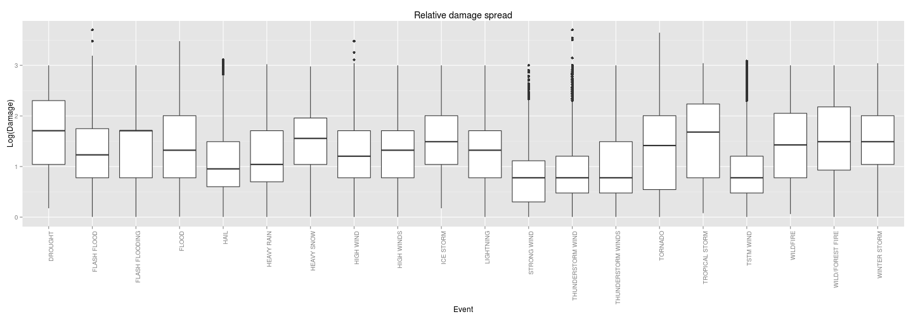

```r
library(ggplot2)
opts_chunk$set(fig.width=20, autodep=T)
```

US Weather impact on health and damage 
=======================================

### Synopsis
Using the [NOAA Storm database](http://www.ncdc.noaa.gov/stormevents/ftp.jsp), exploration will be done in order 
to understand the economic and health impacts within the United States. Specifically the types of events that 
are most harmful with respect to the populations health and the events which have the greatest economic consequences.
This data is aimed at the organization responsible for preparing for severe weather events and prioritizing resources
in such an event. 

For each impact topic, economic and health, we discover the top events - defaulted to 20 as our recommendation, but 
changeable by top_event_amount variable - by their accumulated impact. For better understanding of impact spread, we create a comparison of 
those events with box plots only using the occurrences where impact was found i.e omitting zero values. display the most relevant. Finally we
create a summary table with stats(occurrences, max, average, frequency, impact probability) to better understand the impact spread observed in the
boxplots.

### Data Processing
Data is taken directly from the bzip CSV format


```r
storm_data_file <- 'repdata-data-StormData.csv.bz2'
if(!file.exists(storm_data_file)) stop(sprintf('%s is required to be in the working director(%s)', storm_data_file, getwd()))

storm_data <- read.csv(storm_data_file)[,c("EVTYPE", "PROPDMG", "CROPDMG", "INJURIES", "FATALITIES")]
```

We make little attempt to clean the data by removing the summary data and unknown events. We combine crop and property damage as damage 
to represent damage impact, we combine fatalities and injuries as casualties to 
represent health impact. A summary grouped by event is made from the storm data containing sum, max and average impact. Finally 
we do a probabilty calculus of belief for impact given an event occurs. A limited set of results are calculated and displayed 
controlled by top_events_amount which is ordered by the overall accumulated impact.


```r
#Attemp for some data cleaning

#Remove summary data as this does not contribute to a particular disaster, introducing no new information
storm_data <- storm_data[-grep(('\\?|summary'),storm_data$EVTYPE, ignore.case=T),]
storm_data$EVTYPE <- factor(storm_data$EVTYPE) #synchronize levels

top_event_amount <- 20 #For ease of adjusting the cut off of 'top' events

#Add boolean impact occurences
storm_data$dmg_occur <- storm_data$PROPDMG+storm_data$CROPDMG > 0
storm_data$cas_occur <- storm_data$INJURIES+storm_data$FATALITIES > 0

#Get the cost sum, mean and max of damage and health impact for events
evt_summary <- as.data.frame(as.list(aggregate(cbind(dmg=PROPDMG+CROPDMG,cas=INJURIES + FATALITIES) ~ EVTYPE, storm_data, 
                                               FUN=function(x) c(sum=sum(x), max=max(x)))))

#calculate occurrences
evt_summary$occur <- aggregate(PROPDMG~EVTYPE, storm_data, FUN=length)[,2]

#calculate occurrences
evt_summary$freq <- evt_summary$occur/nrow(storm_data)

#calculate mean of impact only when impact occurs - else average is too misleading
evt_summary$cas.mean <- evt_summary$cas.sum/aggregate(cas_occur ~ EVTYPE, storm_data, FUN=sum)[,2]
evt_summary$dmg.mean <- evt_summary$dmg.sum/aggregate(dmg_occur ~ EVTYPE, storm_data, FUN=sum)[,2]

#Filter out top events (by accumulated damage/casualties)
top_evt_idx <- data.frame(dmg=head(order(evt_summary$dmg.sum, decreasing=T), top_event_amount),
                     cas=head(order(evt_summary$cas.sum, decreasing=T), top_event_amount))

#create impact occurrence contingency table
imp_occur_dmg <- table(storm_data[,c('EVTYPE','dmg_occur')]) #columns: No Impact then Impact
imp_occur_cas <- table(storm_data[,c('EVTYPE','cas_occur')]) #columns: No Impact then Impact

#Get the damage of event per occurence for top damaging events
top_evt_dmg <- storm_data[storm_data$EVTYPE %in% evt_summary[top_evt_idx$dmg,'EVTYPE'], #rows
                              c('EVTYPE', 'PROPDMG', 'CROPDMG')] #columns

top_evt_cas <- storm_data[storm_data$EVTYPE %in% evt_summary[top_evt_idx$cas,'EVTYPE'], #rows
                              c('EVTYPE', 'INJURIES', 'FATALITIES')] #columns


#Calculus of belief for impact occuring
cas_nume <- (imp_occur_cas[top_evt_idx$cas,2]/margin.table(imp_occur_cas,1)[top_evt_idx$cas])*margin.table(imp_occur_cas,2)[2]/margin.table(imp_occur_cas)
cas_denom <- cas_nume+(imp_occur_cas[top_evt_idx$cas,1]/margin.table(imp_occur_cas,1)[top_evt_idx$cas])*margin.table(imp_occur_cas,2)[1]/margin.table(imp_occur_cas)

dmg_nume <- (imp_occur_dmg[top_evt_idx$dmg,2]/margin.table(imp_occur_dmg,1)[top_evt_idx$dmg])*margin.table(imp_occur_dmg,2)[2]/margin.table(imp_occur_dmg)
dmg_denom <- dmg_nume+(imp_occur_dmg[top_evt_idx$dmg,1]/margin.table(imp_occur_dmg,1)[top_evt_idx$dmg])*margin.table(imp_occur_dmg,2)[1]/margin.table(imp_occur_dmg)

bayes <- cbind(cas=cas_nume/cas_denom, dmg=dmg_nume/dmg_denom)
```

### Results

Figure 1 - Top Events by health impact (with zeros omitted to mitigate skewness)

```r
qplot(EVTYPE,  #substitute space with new line for prettiness
      log10(INJURIES+FATALITIES+1), #Use log as data is still heavily skewed
      data=top_evt_cas[top_evt_cas$INJURIES+top_evt_cas$FATALITIES > 0,], 
      geom='boxplot') + xlab('Event') + ylab('Log(Casualties)') + ggtitle('Casualty spread') + theme(axis.text.x=element_text(angle = 90, hjust = 1))
```

 

In figure 1 above, we are able to understand how the spread of casualties per event lies compared with each of the top events. 
Note that we have removed the event occurrences that did not have any casualty impact. We use the log transformation as data is still 
heavily skewed after omitting zeros. There is a rare tendency for high health impact given by the large amounts of outliers and the marginal difference
between the lower quartile and median.

Table 1 - Top Events by health impact

```r
cas_col_names <- c('EVTYPE', 'occur', 'freq', grep('cas', names(evt_summary), value=T))
cas_cols <- cbind(evt_summary[top_evt_idx$cas, c(cas_col_names)], bayes[,1])
kable(
  setNames(cas_cols, c('Event', 'Total Occurences', 'Frequency', 'Total Casualties', 'Most casualties', 'Average casualties during impact', 'Impact Probability')), 
  row.names=F)
```


|Event              | Total Occurences| Frequency| Total Casualties| Most casualties| Average casualties during impact| Impact Probability|
|:------------------|----------------:|---------:|----------------:|---------------:|--------------------------------:|------------------:|
|TORNADO            |            60652|    0.0672|            96979|            1742|                           12.232|             0.0037|
|EXCESSIVE HEAT     |             1678|    0.0019|             8428|             521|                           12.431|             0.0166|
|TSTM WIND          |           219940|    0.2438|             7461|              60|                            2.546|             0.0003|
|FLOOD              |            25326|    0.0281|             7259|             802|                           17.705|             0.0004|
|LIGHTNING          |            15754|    0.0175|             6046|              51|                            1.829|             0.0066|
|HEAT               |              767|    0.0009|             3037|             583|                           14.531|             0.0092|
|FLASH FLOOD        |            54277|    0.0602|             2755|             159|                            2.959|             0.0004|
|ICE STORM          |             2006|    0.0022|             2064|            1569|                           21.726|             0.0012|
|THUNDERSTORM WIND  |            82563|    0.0915|             1621|              70|                            2.377|             0.0002|
|WINTER STORM       |            11433|    0.0127|             1527|             170|                            6.727|             0.0005|
|HIGH WIND          |            20212|    0.0224|             1385|              70|                            2.638|             0.0007|
|HAIL               |           288661|    0.3199|             1376|             109|                            4.778|             0.0000|
|HURRICANE/TYPHOON  |               88|    0.0001|             1339|             787|                           51.500|             0.0103|
|HEAVY SNOW         |            15708|    0.0174|             1148|             185|                            6.074|             0.0003|
|WILDFIRE           |             2761|    0.0031|              986|             104|                            5.031|             0.0019|
|THUNDERSTORM WINDS |            20843|    0.0231|              972|              50|                            2.708|             0.0004|
|BLIZZARD           |             2719|    0.0030|              906|             390|                           10.535|             0.0008|
|FOG                |              538|    0.0006|              796|              80|                            8.652|             0.0051|
|RIP CURRENT        |              470|    0.0005|              600|              11|                            1.504|             0.1228|
|WILD/FOREST FIRE   |             1457|    0.0016|              557|              52|                            4.126|             0.0025|

In table 1 above, we show a summary of the top events ordered by accumulated casualties(fatalities and injuries). 
The average impact is a calculation only for events that had an impact. The Impact probability shows how likely an event 
will have a casualty impact given the occurrence of such an event. This is to better our understanding as to how likely
such an event will cause casualties. The frequency is the occurrences divided by the total events, zeros inclusive, within the raw data.


Figure 2 - Top Events relative damage spread (with zeros omitted to mitigate skewness)

```r
qplot(EVTYPE,
      log10(PROPDMG+CROPDMG+1), #Use log as data is still heavily skewed
      data=top_evt_dmg[top_evt_dmg$CROPDMG+top_evt_dmg$PROPDMG > 0,], 
      geom='boxplot',
      labs(title='Damage')) + xlab('Event') + ylab('Log(Damage)') + ggtitle('Relative damage spread') + theme(axis.text.x=element_text(angle = 90, hjust = 1))
```

 

In figure 2 above, we are able to understand how the spread of damage per event lies compared with each of the top events. Note that we have removed the event occurrences that did not have any damage impact. We use the log transformation as data is still heavily skewed after omitting zeros. It seems that most weather has
a regular damage pattern showing a good degree of consistency, however hail, TSTM winds, thunderstorms and strong winds on odd occasions have extremely high damage from the norm. Finally, Flash flooding shows a consistly high damage given an event of impact indicated by the marginal gap between the upper quartile and the median.


Table 2 - Top Events by damage impact

```r
dmg_col_names <- c('EVTYPE', 'occur', 'freq', grep('dmg', names(evt_summary), value=T))
dmg_cols <- cbind(evt_summary[top_evt_idx$dmg, c(dmg_col_names)], bayes[,2])

kable(
  setNames(dmg_cols, c('Event', 'Total Occurences', 'Frequency', 'Total cost(USD)', 'Highest cost(USD)', 'Average cost(USD) during impact', 'Impact Probability')), 
  row.names=F)
```


|Event              | Total Occurences| Frequency| Total cost(USD)| Highest cost(USD)| Average cost(USD) during impact| Impact Probability|
|:------------------|----------------:|---------:|---------------:|-----------------:|-------------------------------:|------------------:|
|TORNADO            |            60652|    0.0672|         3312277|              4410|                           84.15|             0.4080|
|FLASH FLOOD        |            54277|    0.0602|         1599325|              5000|                           77.42|             0.1864|
|TSTM WIND          |           219940|    0.2438|         1445168|              1213|                           23.51|             0.1264|
|HAIL               |           288661|    0.3199|         1268290|              1300|                           48.84|             0.0355|
|FLOOD              |            25326|    0.0281|         1067976|              3000|                          106.18|             0.1972|
|THUNDERSTORM WIND  |            82563|    0.0915|          943636|              5000|                           21.71|             0.2930|
|LIGHTNING          |            15754|    0.0175|          606932|              1000|                           58.58|             0.4173|
|THUNDERSTORM WINDS |            20843|    0.0231|          464978|              1000|                           38.73|             0.3362|
|HIGH WIND          |            20212|    0.0224|          342015|              3000|                           63.90|             0.1184|
|WINTER STORM       |            11433|    0.0127|          134700|              1100|                           96.98|             0.0490|
|HEAVY SNOW         |            15708|    0.0174|          124418|               950|                          100.01|             0.0311|
|WILDFIRE           |             2761|    0.0031|           88824|              1000|                          114.17|             0.1276|
|ICE STORM          |             2006|    0.0022|           67690|              1000|                          101.48|             0.1566|
|STRONG WIND        |             3566|    0.0040|           64611|              1000|                           19.70|             0.8099|
|HEAVY RAIN         |            11723|    0.0130|           61965|              1050|                           60.04|             0.0347|
|HIGH WINDS         |             1533|    0.0017|           57385|              1000|                           93.92|             0.1981|
|TROPICAL STORM     |              690|    0.0008|           54323|              1100|                          133.47|             0.3490|
|WILD/FOREST FIRE   |             1457|    0.0016|           43534|              1000|                          134.78|             0.0960|
|DROUGHT            |             2488|    0.0028|           37998|              1000|                          142.85|             0.0427|
|FLASH FLOODING     |              682|    0.0008|           33623|              1000|                          114.36|             0.2203|

In table 2 above, we show a summary of the top events ordered by accumulated damage(property and crops). The average impact is a calculation 
only for events that had an impact.The Impact probability shows how likely an event will have a damage impact given the occurrence of such an event. 
This is to better our understanding as to how likely such an event will cause damage.
The frequency is the occurrences divided by the total events within the raw data.
